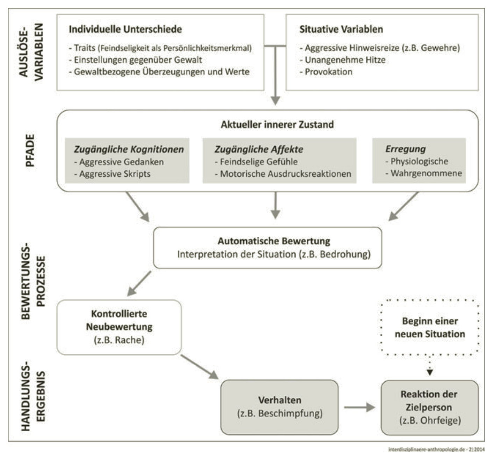

# Wichtige Links {.section-slide}

::: {.links}
[Moodle](https://moodle.fhnw.ch/course/view.php?id=68365) ·
[Programm](https://drive.switch.ch/index.php/s/yuI3Qc3p9ftUmz2)
:::

# Termin 1  
Einführung Aggression und Mobbing

# Termin 2  
Aggression

# The nature of human aggression

Archer, J. (2009). The nature of human aggression. *International Journal of Law and Psychiatry, 32*(4), 202–208. https://doi.org/10.1016/j.ijlp.2009.04.001

# Explanations of Aggression

1. Functional explanations of human aggression
2. Phylogenetic origins of human aggression
3. The developmental origins of human aggression
4. The motivation (immediate cause) of human aggression

# Functional explanations of human aggression

cost–benefit

# Phylogenetic origins of human aggression

- brain mechanisms underlying the expression and inhibition of human aggression
- emotions associated with direct aggression

 -> anger-induced and fear-induced aggression

# The developmental origins of human aggression

- Contrary to what we might expect from the social learning perspective, physical aggression is found at a high level in the second year of postnatal life, and its subsequent development is characterized by learning to inhibit this form of aggression, replacing it with alternative forms of aggression or other ways of achieving social goals.
- Individual differences in aggressive behavior:  
presence of young siblings, early age of motherhood, antisocial behavior by the mother, smoking during pregnancy, postpartum depression, and low parental income ...
- Gene–environment interactions

# The motivation (immediate cause) of human aggression

A model of this system was proposed for animal aggression by Archer (1976), entailing a two-stage process, first the registering of a discrepancy from some important expectation in the current input, which generates an affective state, and a second decision-process that evaluates the specific situation in relation to stored associations and expectancies. The end-product of activation of the system is removal of the source of the discrepancy from the animal's environment, or in the case of a fear response, removal of the animal from the situation.

# Fokusthema

Nach der Lektüre und Diskussion

- Halten Sie die zentralen theoretischen Konzepte, Befunde und Erklärungsansätze fest.
- Leiten Sie aus diesen Erkenntnissen relevante Schlussfolgerungen für Ihr Fokusthema ab. 
- Halten Sie Ihre Überlegungen in strukturierter Form fest (z. B. Stichpunkte, kurze Ausführungen oder Skizzen).

# Aggression: Eine sozialpsychologische Perspektive

Krahé, B. (2015). Aggression: Eine sozialpsychologische Perspektive. In G. Hartung & M. Herrgen (Eds), *Interdisziplinäre Anthropologie* (pp. 13–48). Springer Fachmedien Wiesbaden.

# Definition und drei  Leitfragen 

In der Sozialpsychologie versteht man unter Aggression eine Form des sozialen Verhaltens, d.h. ein Verhalten von einzelnen Personen oder Gruppen gegenüber anderen Personen oder Gruppen.

(a) Maßgeblich für die Qualifikation eines Verhaltens als „aggressiv“ ist die Schädigungsabsicht, also die dem Verhalten zugrunde liegende Motivation. 
(b) Die für die Bewertung eines Verhaltens als aggressiv geforderte Schädigungsabsicht setzt ihrerseits voraus, dass die handelnde Person sich über die Konsequenzen ihres Verhaltens im Klaren ist. 
(c) Schließlich führt die definitorische Festlegung, dass die Zielperson motiviert sein muss, die schädigende Behandlung zu vermeiden. 

# Theorien Biologische Ansätze

Verhaltensgenetik ... beeinflusst durch die genetische Ausstattung  
Hormonelle Erklärungen ... beeinflusst durch Testosteron und Kortisol   
Vergleichende Verhaltensforschung (Ethologie)  ... Produkt einer inneren Energie, die durch äußere Hinweisreize freigesetzt wird   
Evolutionsbiologie ... Ergebnis der natürlichen Selektion  

# Theorien Psychologische Ansätze 

Frustrations- AggressionsHypothese  ... eine durch Frustration ausgelöste Reaktion, deren Wahrscheinlichkeit durch aggressive Hinweisreize erhöht wird   
Kognitives neoassoziationistisches Modell  ... Ergebnis negativen Affekts, der durch unangenehme Reize ausgelöst und als Ärger interpretiert wird   
Erregungsübertragung ... Intensivierung von Ärger-Erregung durch die  Fehlattribution von körperlicher Erregung aus neutraler Quelle  
Lerntheorie ... Ergebnis von Verstärkung, entweder direkt oder  indirekt (beobachtet)  
Sozial-kognitive Ansätze ... Ergebnis sozialer Informationsverarbeitung und  erlernter Verhaltensdrehbücher (Skripts)   
Allgemeines Aggressions Modell  ... Integration der in den vorherigen Modellen spezifizierten kognitiven und affektiven Mechanismen

# Allgemeines Aggressions-Modell (GAM; General  Aggression Model)

::: {.source}
Allen, J. J., Anderson, C. A., & Bushman, B. J. (2018). The general aggression model. *Current Opinion in Psychology, 19*, 75–80. https://doi.org/10.1016/j.copsyc.2017.03.034
:::

# Fokusthema

Nach der Lektüre und Diskussion

- Halten Sie die zentralen theoretischen Konzepte, Befunde und Erklärungsansätze fest.
- Leiten Sie aus diesen Erkenntnissen relevante Schlussfolgerungen für Ihr Fokusthema ab. 
- Halten Sie Ihre Überlegungen in strukturierter Form fest (z. B. Stichpunkte, kurze Ausführungen oder Skizzen).

# The development of aggression in  childhood and adolescence

Pepler, D. J. (2018). The development of aggression in childhood and adolescence. In J. L. Ireland, P. Birch, & C. A. Ireland (Eds), *The Routledge international handbook of human aggression: Current issues and perspectives* (pp. 3–18). Routledge.

# Development through relationships

Two questions arise in considering the mechanisms in relationships through which children develop aggression:  
(1) What relationship capacities need to develop and do not develop for these children, and  
(2) What aggressive tendencies develop instead?

# Individual characteristics that place children at risk for aggression

- gene–environment interactions
- Temperament

# Relationships in the development of aggression

“an emotionally warm, attentive, accepting, normoriented supervising and structure-giving upbringing encourages the positive development of children”.

(1) a positive orientation in relationships,   
(2) emotional and behavioural regulation,   
(3) prosocial behaviour and problem solving, and   
(4) understanding of and concern for others

Family processes - Peer processes - School processes

# Fokusthema

Nach der Lektüre und Diskussion

- Halten Sie die zentralen theoretischen Konzepte, Befunde und Erklärungsansätze fest.
- Leiten Sie aus diesen Erkenntnissen relevante Schlussfolgerungen für Ihr Fokusthema ab. 
- Halten Sie Ihre Überlegungen in strukturierter Form fest (z. B. Stichpunkte, kurze Ausführungen oder Skizzen).

# Formen und Klassifikation aggressiven Verhaltens

Petermann, F., & Koglin, U. (2013). Formen und Klassifikation aggressiven Verhaltens (Kapitel 2). In F. Petermann & U. Koglin, *Aggression und Gewalt von Kindern und Jugendlichen* (pp. 7–17). Springer.

# Fokusthema

Nach der Lektüre und Diskussion

- Halten Sie die zentralen theoretischen Konzepte, Befunde und Erklärungsansätze fest.
- Leiten Sie aus diesen Erkenntnissen relevante Schlussfolgerungen für Ihr Fokusthema ab. 
- Halten Sie Ihre Überlegungen in strukturierter Form fest (z. B. Stichpunkte, kurze Ausführungen oder Skizzen).

